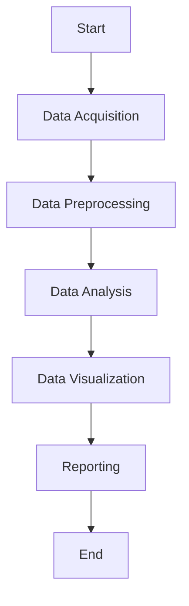

# Seismology Data Analysis and Visualization Package
## Abstract Workflow
The package will provide a streamlined workflow for seismology data analysis and visualization.
## Activity Diagram

## Component Analysis
### 1. Data Acquisition
- **Purpose**: To collect seismology data from various sources.
- **Inputs**: Source type (e.g., file path, database connection).
- **Outputs**: Raw data in a structured format.
### 2. Data Preprocessing
- **Purpose**: To clean and transform raw data to a usable state.
- **Inputs**: Raw data.
- **Processes**:
  - Handling missing values.
  - Normalizing data.
  - Filtering noise.
- **Outputs**: Preprocessed data ready for analysis.
### 3. Data Analysis
- **Purpose**: To apply analytical methods to extract insights from data.
- **Inputs**: Preprocessed data.
- **Processes**:
  - Frequency analysis.
  - Event detection.
  - Statistical analysis.
- **Outputs**: Analytical results.
### 4. Data Visualization
- **Purpose**: To create visual representations of the analytical results.
- **Inputs**: Analytical results.
- **Processes**:
  - Generating plots (e.g., time series, spectrograms).
  - Creating interactive visualizations.
- **Outputs**: Visualizations (e.g., charts, graphs).
### 5. Reporting
- **Purpose**: To compile results and visualizations into a comprehensive report.
- **Inputs**: Analytical results, visualizations.
- **Processes**:
  - Formatting text.
  - Embedding visualizations.
- **Outputs**: Report document (e.g., PDF, HTML).
## Functional Requirements
1. **Data Acquisition Module**
   - Should support importing data from various file formats (e.g., CSV, JSON).
   - Should support connecting to online seismology databases.
2. **Data Preprocessing Module**
   - Should provide functions for handling missing values.
   - Should include data normalization and noise filtering techniques.
3. **Data Analysis Module**
   - Should offer a range of analytical methods (e.g., frequency analysis, event detection).
   - Should support statistical analysis of seismology data.
4. **Data Visualization Module**
   - Should enable creation of various plots (e.g., time series, spectrograms).
   - Should support interactive visualizations.
5. **Reporting Module**
   - Should allow for the generation of comprehensive reports.
   - Should support multiple report formats (e.g., PDF, HTML).
## Non-Functional Requirements
1. **Performance**
   - The package should handle large datasets efficiently.
   - The analysis and visualization processes should be optimized for speed.
2. **Usability**
   - The package should have a clear and concise documentation.
   - The interface should be user-friendly and intuitive.
3. **Scalability**
   - The package should be able to scale with increasing data sizes and complexity of analyses.
   - It should support parallel processing where applicable.
4. **Reliability**
   - The package should provide accurate and consistent results.
   - It should include error handling and logging mechanisms.
5. **Maintainability**
   - The code should follow best practices and be well-documented.
   - The package should be modular to facilitate updates and maintenance.
6. **Compatibility**
   - The package should be compatible with major operating systems (Windows, macOS, Linux).
   - It should support integration with other scientific Python libraries (e.g., NumPy, SciPy, Matplotlib).
---