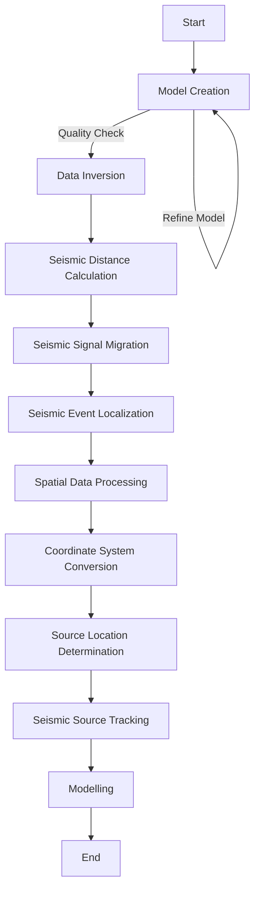

# Pyseis
## Abstract Workflow
The package will provide a streamlined workflow for seismology data analysis and modelling.
## Activity Diagram

### Functional Requirements
1. **Model Creation**: This is the first step where we create reference models using the methods: ***fmi_parameters*** and ***fmi_spectra***.
2. **Data Inversion**: Here, we invert fluvial data sets based on the reference spectra catalogue created in the previous step using the method: ***fmi_inversion***.
3. **Seismic Distance Calculation**: In this step, we calculate the topography-corrected distances for seismic waves using the method: ***spatial_distance***.
4. **Seismic Signal Migration**: Now, we migrate the seismic signals through a grid of locations using the method: ***spatial_migrate***.
5. **Seismic Event Localization**: At this stage, we locate the source of a seismic event by modelling amplitude attenuation using the method: ***spatial_amplitude***.
6. **Spatial Data Processing**: Here, we process the spatial data by clipping values and normalizing them if necessary using the method: ***spatial_clip***.
7. **Coordinate System Conversion**: In this step, we convert the coordinates between different reference systems using the method: ***spatial_convert***.
8. **Source Location Determination**: Now, we determine the most likely source location(s) based on the processed data using the method: ***spatial_pmax***.
9. **Seismic Source Tracking**: At this stage, we track a spatially mobile seismic source using the method: ***spatial_track***.
10. **Modelling**: Finally, we model the seismic spectrum due to bedload transport in rivers and hydraulic turbulence using the methods: ***model_bedload*** and ***model_turbulence***.
## Component Analysis
| Abstract Workflow Node | Operation | Input(s) | Output(s) | Implementation |
| --- | --- | --- | --- | --- |
| **Model Creation** | | | | | |
| fmi_inversion | Invert fluvial data set based on reference spectra catalogue |  |  |  |
| fmi_parameters | Create reference model reference parameter catalogue |  |  |  |
| **Data Inversion** | | | | | |
| fmi_spectra | Create reference model spectra catalogue |  |  |  |
| **Seismic Distance Calculation** | | | | | |
| spatial_distance | Calculate topography-corrected distances for seismic waves | ***stations:*** Numeric matrix of length two, x- and y-coordinates of the seismic stations   ***dem:*** SpatRaster object, the digital elevation model (DEM) to be processed   ***topography:*** Logical scalar, option to enable topography correction   ***maps:*** Logical scalar, option to enable/disable calculation of distance maps   ***matrix:*** Logical scalar, option to enable/disable calculation of interstation distances   ***aoi:*** Numeric vector of length four, bounding coordinates of the area of interest   ***verbose:*** Logical value, option to show extended function information | List object with distance maps (list of SpatRaster objects from terra package) and station distance matrix (data.frame) | Niaz |
| **Seismic Signal Migration** | | | | | |
| spatial_migrate | Migrate signals of a seismic event through a grid of locations | ***data:*** Numeric matrix or eseis object, seismic signals to cross-correlate   ***d_stations:*** Numeric matrix, inter-station distances. Output of spatial_distance   ***d_map:*** List object, distance maps for each station. Output of spatial_distance   ***snr:*** Numeric vector, optional signal-to-noise-ratios for each signal trace, used for normalisation   ***v:*** Numeric value, mean velocity of seismic waves (m/s)   ***dt:*** Numeric value, sampling period   ***normalise:*** Logical value, option to normalise stations correlations by signal-to-noise-ratios   ***verbose:*** Logical value, option to show extended function information | SpatialGridDataFrame-object with Gaussian probability density function values for each grid cell | Niaz |
| **Seismic Event Localization** | | | | | |
| spatial_amplitude | Locate the source of a seismic event by modelling amplitude attenuation | ***data:*** Numeric matrix or eseis object, seismic signals to work with   ***coupling:*** Numeric vector, coupling efficiency factors for each seismic station   ***d_map:*** List object, distance maps for each station. Output of spatial_distance   ***aoi:*** raster object that defines which pixels are used to locate the source   ***v:*** Numeric value, mean velocity of seismic waves (m/s)   ***q:*** Numeric value, quality factor of the ground   ***f:*** Numeric value, frequency for which to model the attenuation   ***a_0:*** Logical value, start parameter of the source amplitude   ***normalise:*** Logical value, option to normalise sum of residuals between 0 and 1   ***output:*** Character value, type of metric the function returns   ***cpu:*** Numeric value, fraction of CPUs to use |  Raster object with the location output metrics for each grid cell | Niaz |
| **Spatial Data Processing** | | | | | |
| spatial_clip | Clip values of spatial data | ***data:*** SpatRaster object, spatial data set to be processed   ***quantile:*** Numeric value, quantile value below which raster values are clipped   ***replace:*** Numeric value, replacement value   ***normalise:*** Logical value, optionally normalise values above threshold quantile between 0 and 1 | SpatRaster object, data set with clipped values | Lamia |
| **Coordinate System Conversion** | | | | | |
| spatial_convert | Convert coordinates between reference systems | ***data:*** Numeric vector of length two or data frame, x-, y-coordinates to be converted   ***from:*** Character value, proj4 string of the input reference system   ***to:*** Character value, proj4 string of the output reference system | Numeric data frame with converted coordinates | Lamia |
| **Source Location Determination** | | | | | |
| spatial_pmax | Get most likely source location | ***data:*** SpatRaster object, spatial data set with source location estimates | data.frame, coordinates (x and y) of the most likely source location(s) | Lamia |
| **Seismic Source Tracking** | | | | | |
| spatial_track | Track a spatially mobile seismic source |  |  |  |
| **Modelling** | | | | | |
| model_bedload | Model the seismic spectrum due to bedload transport in rivers |  |  |  |
| model_turbulence | Model the seismic spectrum due to hydraulic turbulence |  |  |  |

## Non-Functional Requirements
1. **Performance**
   - The package should handle large datasets efficiently.
   - The processes should be optimized for speed.
2. **Usability**
   - The package should have a clear and concise documentation.
   - The tool should be user-friendly.
3. **Scalability**
   - The package should be able to scale with increasing data sizes and complexity of analyses.
4. **Reliability**
   - The package should provide accurate and consistent results.
   - It should include error handling and logging mechanisms.
5. **Maintainability**
   - The code should follow best practices and be well-documented.
   - The package should be modular to facilitate updates and maintenance.
6. **Compatibility**
   - The package should be compatible with major operating systems (Windows, macOS, Linux).
   - It should support integration with other scientific Python libraries (e.g., NumPy, SciPy, Matplotlib).
---