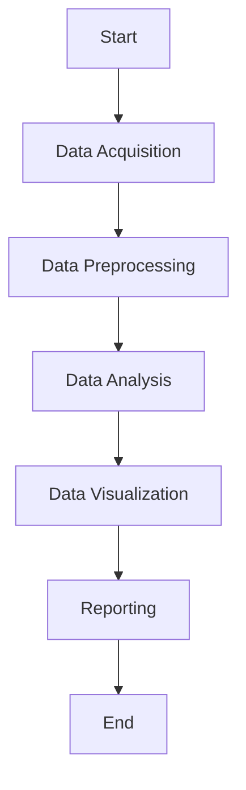

# Seismology Data Analysis and Visualization Package
## Abstract Workflow
The package will provide a streamlined workflow for seismology data analysis and visualization.
## Activity Diagram

## Component Analysis

| Abstract Workflow Node   | Operation                                                               | Input(s)                                                                                                                                                                                                                     | Output(s)                                                                                                               | Implementation   |
|:-------------------------|:------------------------------------------------------------------------|:-----------------------------------------------------------------------------------------------------------------------------------------------------------------------------------------------------------------------------|:------------------------------------------------------------------------------------------------------------------------|:-----------------|
| fmi_inversion            | Invert fluvial data set based on reference spectra catalogue            | nan                                                                                                                                                                                                                          | nan                                                                                                                     | …                |
| fmi_parameters           | Create reference model reference parameter catalogue                    | nan                                                                                                                                                                                                                          | nan                                                                                                                     | nan              |
| fmi_spectra              | Create reference model spectra catalogue                                | nan                                                                                                                                                                                                                          | nan                                                                                                                     | nan              |
| spatial_distance         | Calculate topography-corrected distances for seismic waves              | stations Numeric matrix of length two, x- and y-coordinates of the seismic stations                                                                                                                                          | List object with distance maps (list of SpatRaster objects from terra package) and station distance matrix (data.frame) | Niaz             |
|                          |                                                                         | dem SpatRaster object, the digital elevation model (DEM) to be processed.                                                                                                                                                    |                                                                                                                         |                  |
|                          |                                                                         | topography Logical scalar, option to enable topography correction                                                                                                                                                            |                                                                                                                         |                  |
|                          |                                                                         | maps Logical scalar, option to enable/disable calculation of distance maps.                                                                                                                                                  |                                                                                                                         |                  |
|                          |                                                                         | matrix Logical scalar, option to enable/disable calculation of interstation distances.                                                                                                                                       |                                                                                                                         |                  |
|                          |                                                                         | aoi Numeric vector of length four, bounding coordinates of the area of interest.                                                                                                                                             |                                                                                                                         |                  |
|                          |                                                                         | verbose Logical value, option to show extended function information                                                                                                                                                          |                                                                                                                         |                  |
| spatial_migrate          | Migrate signals of a seismic event through a grid of locations          | data Numeric matrix or eseis object, seismic signals to cross-correlate.                                                                                                                                                     | A SpatialGridDataFrame-object with Gaussian probability density function values for each grid cell                      | Niaz             |
|                          |                                                                         | d_stations Numeric matrix, inter-station distances. Output of spatial_distance.                                                                                                                                              |                                                                                                                         |                  |
|                          |                                                                         | d_map List object, distance maps for each station. Output of spatial_distance.                                                                                                                                               |                                                                                                                         |                  |
|                          |                                                                         | snr Numeric vector, optional signal-to-noise-ratios for each signal trace, used for                                                                                                                                          |                                                                                                                         |                  |
|                          |                                                                         | normalisation.                                                                                                                                                                                                               |                                                                                                                         |                  |
|                          |                                                                         | v Numeric value, mean velocity of seismic waves (m/s).                                                                                                                                                                       |                                                                                                                         |                  |
|                          |                                                                         | dt Numeric value, sampling period.                                                                                                                                                                                           |                                                                                                                         |                  |
|                          |                                                                         | normalise Logical value, option to normalise stations correlations by signal-to-noise-ratios.                                                            verbose Logical value, option to show extended function information |                                                                                                                         |                  |
| spatial_ amplitude       | Locate the source of a seismic event by modelling amplutide attenuation | data Numeric matrix or eseis object, seismic signals to work with.                                                                                                                                                           | A raster object with the location output metrics for each grid cell                                                     | Niaz             |
|                          |                                                                         | coupling Numeric vector, coupling efficiency factors for each seismic station                                                                                                                                                |                                                                                                                         |                  |
|                          |                                                                         | d_map List object, distance maps for each station.  Output of spatial_distance.                                                                                                                                              |                                                                                                                         |                  |
|                          |                                                                         | aoi raster object that defines which pixels are used to locate the source                                                                                                                                                    |                                                                                                                         |                  |
|                          |                                                                         | v Numeric value, mean velocity of seismic waves (m/s).                                                                                                                                                                       |                                                                                                                         |                  |
|                          |                                                                         | q Numeric value, quality factor of the ground.                                                                                                                                                                               |                                                                                                                         |                  |
|                          |                                                                         | f Numeric value, frequency for which to model the attenuation.                                                                                                                                                               |                                                                                                                         |                  |
|                          |                                                                         | a_0 Logical value, start parameter of the source amplitude,                                                                                                                                                                  |                                                                                                                         |                  |
|                          |                                                                         | normalise Logical value, option to normalise sum of residuals between 0 and 1,                                                                                                                                               |                                                                                                                         |                  |
|                          |                                                                         | output Character value, type of metric the function returns.,                                                                                                                                                                |                                                                                                                         |                  |
|                          |                                                                         | cpu Numeric value, fraction of CPUs to use.                                                                                                                                                                                  |                                                                                                                         |                  |
| spatial_clip             | Clip values of spatial data                                             | data SpatRaster object, spatial data set to be processed.                                                                                                                                                                    | SpatRaster object, data set with clipped values                                                                         | Lamia            |
|                          |                                                                         | quantile Numeric value, quantile value below which raster values are clipped.                                                                                                                                                |                                                                                                                         |                  |
|                          |                                                                         | replace Numeric value, replacement value.                                                                                                                                                                                    |                                                                                                                         |                  |
|                          |                                                                         | normalise Logical value, optionally normalise values above threshold quantile between 0 and 1.                                                                                                                               |                                                                                                                         |                  |
| spatial_convert          | Convert coordinates between reference systems                           | data Numeric vector of length two or data frame, x-, y-coordinates to be converted.                                                                                                                                          | Numeric data frame with converted coordinates                                                                           | Lamia            |
|                          |                                                                         | from Character value, proj4 string of the input reference system.                                                                                                                                                            |                                                                                                                         |                  |
|                          |                                                                         | to Character value, proj4 string of the output reference system.                                                                                                                                                             |                                                                                                                         |                  |
| spatial_pmax             | Get most likely source location                                         | data SpatRaster object, spatial data set with source location estimates.                                                                                                                                                     | data.frame, coordinates (x and y) of the most likely s ource location(s).                                               | Lamia            |
| spatial_track            | Track a spatially mobile seismic source                                 | nan                                                                                                                                                                                                                          | nan                                                                                                                     | nan              |
| model_bedload            | Model the seismic spectrum due to bedload transport in rivers           | nan                                                                                                                                                                                                                          | nan                                                                                                                     | nan              |
| model_turbulence         | Model the seismic spectrum due to hydraulic turbulence                  | nan                                                                                                                                                                                                                          | nan                                                                                                                     | nan              |

### 1. Data Acquisition
- **Purpose**: To collect seismology data from various sources.
- **Inputs**: Source type (e.g., file path, database connection).
- **Outputs**: Raw data in a structured format.
### 2. Data Preprocessing
- **Purpose**: To clean and transform raw data to a usable state.
- **Inputs**: Raw data.
- **Processes**:
  - Handling missing values.
  - Normalizing data.
  - Filtering noise.
- **Outputs**: Preprocessed data ready for analysis.
### 3. Data Analysis
- **Purpose**: To apply analytical methods to extract insights from data.
- **Inputs**: Preprocessed data.
- **Processes**:
  - Frequency analysis.
  - Event detection.
  - Statistical analysis.
- **Outputs**: Analytical results.
### 4. Data Visualization
- **Purpose**: To create visual representations of the analytical results.
- **Inputs**: Analytical results.
- **Processes**:
  - Generating plots (e.g., time series, spectrograms).
  - Creating interactive visualizations.
- **Outputs**: Visualizations (e.g., charts, graphs).
### 5. Reporting
- **Purpose**: To compile results and visualizations into a comprehensive report.
- **Inputs**: Analytical results, visualizations.
- **Processes**:
  - Formatting text.
  - Embedding visualizations.
- **Outputs**: Report document (e.g., PDF, HTML).
## Functional Requirements
1. **Data Acquisition Module**
   - Should support importing data from various file formats (e.g., CSV, JSON).
   - Should support connecting to online seismology databases.
2. **Data Preprocessing Module**
   - Should provide functions for handling missing values.
   - Should include data normalization and noise filtering techniques.
3. **Data Analysis Module**
   - Should offer a range of analytical methods (e.g., frequency analysis, event detection).
   - Should support statistical analysis of seismology data.
4. **Data Visualization Module**
   - Should enable creation of various plots (e.g., time series, spectrograms).
   - Should support interactive visualizations.
5. **Reporting Module**
   - Should allow for the generation of comprehensive reports.
   - Should support multiple report formats (e.g., PDF, HTML).
## Non-Functional Requirements
1. **Performance**
   - The package should handle large datasets efficiently.
   - The analysis and visualization processes should be optimized for speed.
2. **Usability**
   - The package should have a clear and concise documentation.
   - The interface should be user-friendly and intuitive.
3. **Scalability**
   - The package should be able to scale with increasing data sizes and complexity of analyses.
   - It should support parallel processing where applicable.
4. **Reliability**
   - The package should provide accurate and consistent results.
   - It should include error handling and logging mechanisms.
5. **Maintainability**
   - The code should follow best practices and be well-documented.
   - The package should be modular to facilitate updates and maintenance.
6. **Compatibility**
   - The package should be compatible with major operating systems (Windows, macOS, Linux).
   - It should support integration with other scientific Python libraries (e.g., NumPy, SciPy, Matplotlib).
---