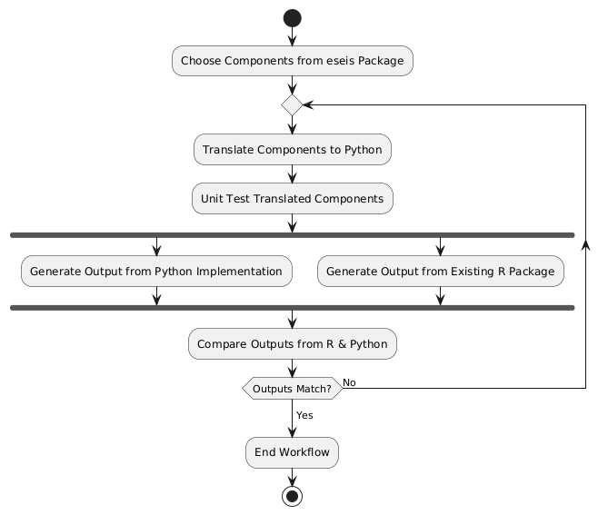

# Pyseis
## Functional Requirements

### Abstract Description

The data analysis workflow is designed to facilitate the translation and validation of seismological data analysis components from the R programming language to Python. This workflow ensures that the translated components are functionally equivalent to their original counterparts by comparing the outputs from both implementations. After the UML diagram abstract description of each step in the workflow is given:

### UML Activity Diagram

Below is the PlantUML code for the described activity diagram, incorporating the loop back to the translation step using the `repeat` syntax:

### Component Selection
Identify and select specific components from the existing `eseis` package, which is used for seismological data analysis in R. We only selected the components which are not currently available in Python.

### Translation to Python
Translate the selected R components into Python, ensuring that the functionality and logic of the original components are preserved.

### Unit Testing
Conduct unit testing on the translated Python components to verify their correctness and ensure they perform as expected.

### Output Generation
Generate outputs using both the translated Python components and the original R components. This step is performed in parallel to maintain efficiency.

### Output Comparison
Compare the outputs generated from the Python and R implementations to check for consistency and accuracy.

### Validation Decision
Evaluate whether the outputs from both implementations match:
- **If the outputs match**: The workflow concludes successfully, indicating that the translated Python components are functionally equivalent to the original R components.
- **If the outputs do not match**: Debug the translated components, identify discrepancies, and reiterate the translation process until the outputs match.

### Debug and Reiterate
If discrepancies are found during the output comparison, debug the translated Python components. This involves analyzing the differences, correcting any issues, and repeating the translation and validation steps until consistency is achieved.

## Component Analysis
In this section, we identify and select specific components from the existing eseis package, which is used for seismological data analysis in R. We have focused on translating components that are not currently available in Python. The table below lists these components, detailing their operations, inputs, outputs, and implementation. 

| Component         | Operation                                                        | Input(s)                                                                                                                           | Output(s)                                               | Implementation                              |
| ----------------- | ---------------------------------------------------------------- | --------------------------------------------------------------------------------------------------------------------------------- | ------------------------------------------------------- | ------------------------------------------- |
| fmi_inversion     | Invert fluvial data set based on reference spectra catalogue     | reference list, seismic dataset, number of cores                                                                                   | list containing the inversion results                   | Available in R package (eseis), to be translated to Python    |
| fmi_parameters    | Create reference model reference parameter catalogue             | ground, river, and topographical parameters                                                                                       | list with model reference parameters                    | Available in R package (eseis), to be translated to Python    |
| fmi_spectra       | Create reference model spectra catalogue                         | model parameters, number of cores                                                                                                 | list containing input parameters and calculated spectra | Available in R package (eseis), to be translated to Python    |
| spatial_distance  | Calculate topography-corrected distances for seismic waves       | stations coordinates, DEM, options for topography correction, maps, interstation distances, area of interest, verbose flag         | list object with distance maps and station distance matrix | Available in R package (eseis), to be translated to Python       |
| spatial_migrate   | Migrate signals of a seismic event through a grid of locations   | seismic signals, inter-station distances, distance maps, SNR, velocity, sampling period, normalise option, verbose flag            | spatialGridDataFrame with Gaussian probability density  | Available in R package (eseis), to be translated to Python       |
| spatial_amplitude | Locate the source of a seismic event by modelling amplitude      | seismic signals, coupling factors, distance maps, area of interest, velocity, quality factor, frequency, source amplitude, verbose flag | raster object with location output metrics              | Available in R package (eseis), to be translated to Python       |
| spatial_clip      | Clip values of spatial data                                      | SpatRaster data, quantile, replacement value, normalise option                                                                    | SpatRaster object with clipped values                   | Available in R package (eseis), to be translated to Python      |
| spatial_convert   | Convert coordinates between reference systems                    | coordinates, input reference system, output reference system                                                                      | numeric data frame with converted coordinates           | Available in R package (eseis), to be translated to Python      |
| spatial_pmax      | Get most likely source location                                  | SpatRaster data set with source location estimates                                                                                | data frame with coordinates of the most likely source location(s) | Available in R package (eseis), to be translated to Python      |
| spatial_track     | Track a spatially mobile seismic source                          | seismic signals, coupling efficiency, time window, distance maps, area of interest, velocity, quality factor, frequency, CPUs, verbose flag | list object with summarising statistics of the fits     | Available in R package (eseis), to be translated to Python       |
| model_bedload     | Model the seismic spectrum due to bedload transport in rivers    | grain-size distribution, sediment parameters, fluid flow parameters, frequency range, distance to source, reference frequency, quality factor, Rayleigh wave parameters | eseis object containing the modelled spectrum           | Available in R package (eseis), to be translated to Python       |
| model_turbulence  | Model the seismic spectrum due to hydraulic turbulence           | sediment parameters, fluid flow parameters, frequency range, distance to source, reference frequency, quality factor, Rayleigh wave parameters | eseis object containing the modelled spectrum           | Available in R package (eseis), to be translated to Python       |

## Non-Functional Requirements
1. **Performance**
   - The package should handle large datasets efficiently.
   - The processes should be optimized for speed.
2. **Usability**
   - The package should have a clear and concise documentation.
   - The tool should be user-friendly.
3. **Scalability**
   - The package should be able to scale with increasing data sizes and complexity of analyses.
4. **Reliability**
   - The package should provide accurate and consistent results.
   - It should include error handling and logging mechanisms.
5. **Maintainability**
   - The code should follow best practices and be well-documented.
   - The package should be modular to facilitate updates and maintenance.
6. **Compatibility**
   - The package should be compatible with major operating systems (Windows, macOS, Linux).
   - It should support integration with other scientific Python libraries (e.g., NumPy, SciPy, Matplotlib).
---